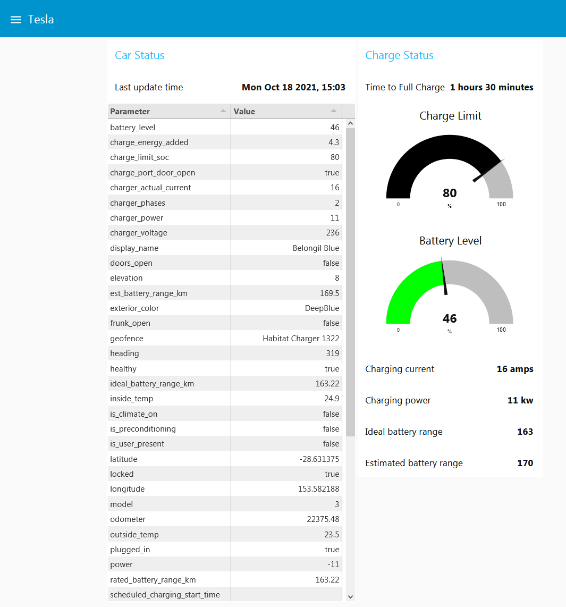

# Overview
From the Node-RED website:
> Node-RED is a programming tool for wiring together hardware devices, APIs and online services in new and interesting ways.

> It provides a browser-based editor that makes it easy to wire together flows using the wide range of nodes in the palette that can be deployed to its runtime in a single-click.

The high-level logic "flow" is coded by wiring "nodes" in the user interface. Low-level logic can be coded in JavaScript. Visit the [Node-RED website](https://nodered.org) for a good introduction on its homepage.

This integration guide includes Node-RED flows with two examples:
- A simple dashboard with Car Status and Charging Status panels
- Notification logic for state changes, entering/exiting geofences and time remaining to charge. The example sends notifications to Telegram, but this can easily be replaced with a node sending the text elsewhere.

|<b>Node-RED Dashboard</b>|
|:--:|
||


|<b>Example Telegram Notifications</b>|
|:--:|
||


# Docker Entries
```
services:
  node-red:
    image: nodered/node-red:latest
    restart: always
    environment:
      - TZ=${TM_TZ}
    volumes:
      - node-red-data:/data
    ports:
      - "1880:1880"
      
volumes:
  node-red-data:
```
